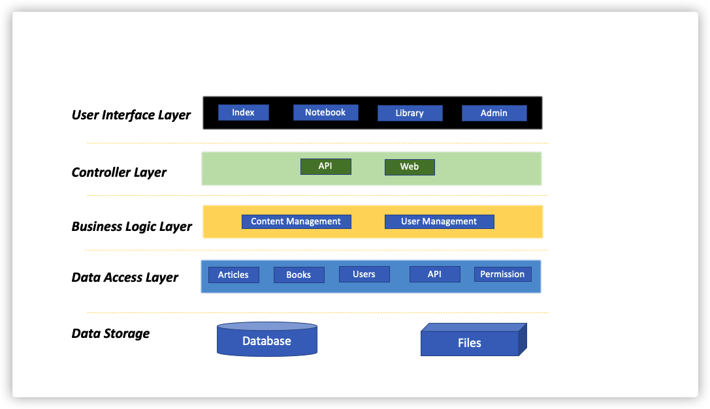
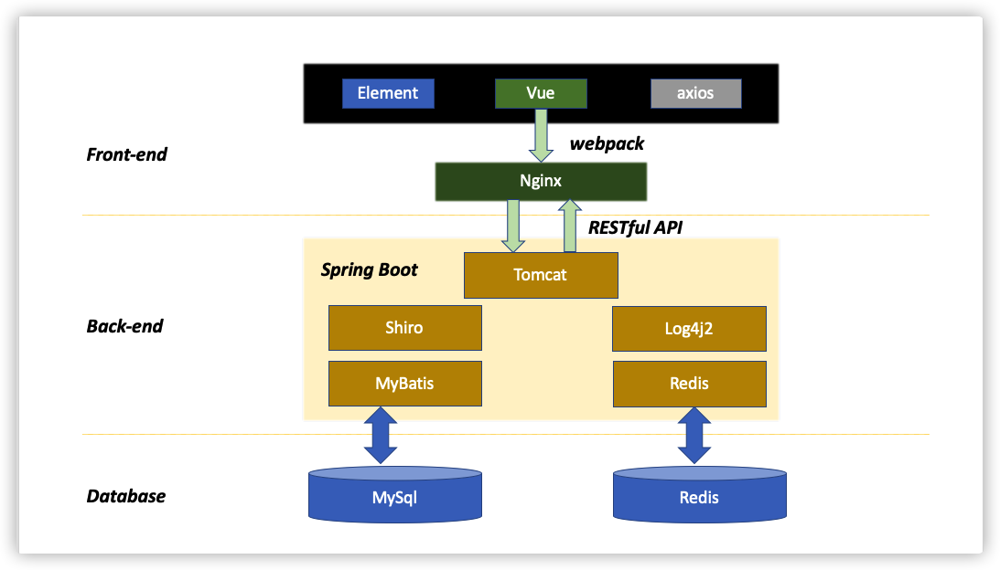

This is a simple front-end and back-end separation project, mainly developed using Vue.js + SpringBoot technology stack.

back-end: [back-end URL:](https://github.com/diandian2710/Library_Spring-Boot)

front-end: [front-end URL:](https://github.com/diandian2710/Library_Vue)

# The Overall Appearance

## Index Page

## Library

Provide book information display function

## Admin

Including dashboard, content management, user and permission management, etc.

# Architecture Diagram

- **Application Architecture**

- **Technology Architecture**

# Main Technology Stack

## Front-End

1.Vue.js
2.ElementUI
3.axios

## Back-End

1.Spring Boot
2.Apache Shiro
3.Apache Log4j2
4.Spring MyBatis
5.Spring Data Redis

## Database

1.MySQL  
2.Redis

# Update

## 2020
11-2 Refactored the project, completed the establishment of the basic background interface, realized loading the menu by role, and cancelled the front desk access restriction 
10-27 Use the front-end interceptor, migrate the database to mysql 8.0.15, and initialize the background management page 
10-13 Complete the picture upload function 
10-11 Complete the book classification function 
10-08 Complete the book paging function 
10-06 Complete the book query function 
10-05 Complete the book modification function 
10-04 Complete the book deletion function 
10-03 Complete the new functions of the book 
